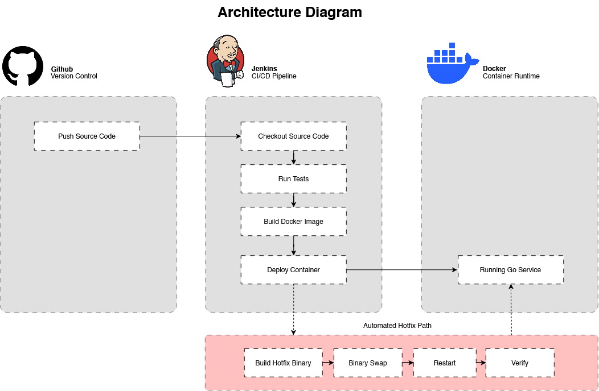
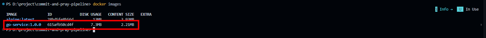
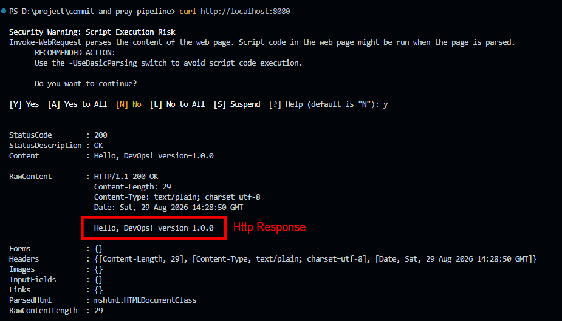
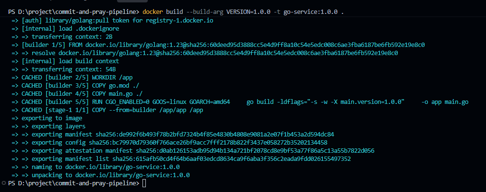
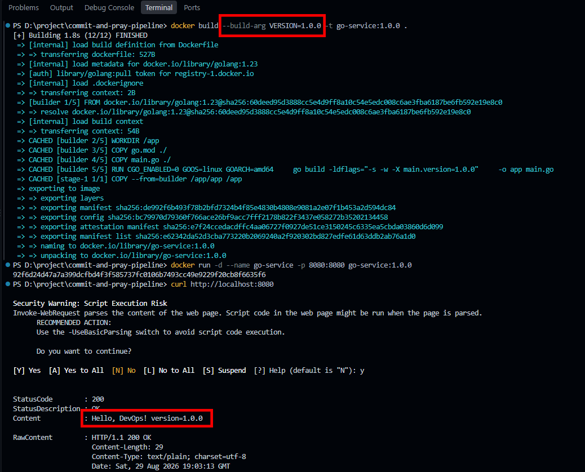
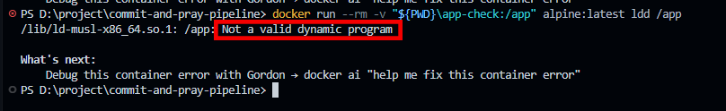

# Commit And Pray

> A small Go service with a CI/CD pipeline.  

A simple DevOps project using **Go, GitHub, Docker, and Jenkins**.

---

## Architecture

---

# Part I — Build

## 1. Multi-stage Docker Build

The application is built using a multi-stage Dockerfile.

The first stage is used to compile the Go application into a statically linked Linux binary.

The final stage uses `scratch` and contains only the compiled application binary.

### Why `scratch`?

`scratch` was chosen because the application can run as a standalone static binary and does not need a shell, package manager, Go toolchain, or additional runtime dependencies.

This keeps the final image small and removes unnecessary components from the runtime image.

### Static Binary

The binary is built with `CGO_ENABLED=0`, which allows it to run without depending on shared libraries from the builder environment.

The binary was also checked to verify that it does not depend on dynamic shared libraries.

---

## 2. Version Injection

The application version is injected during the build process using Go linker flags (`-ldflags`).

The source code keeps the default version as `dev`, while the build process can provide a specific version.

For example:

`VERSION=1.0.0`

The application then returns:

`Hello, DevOps! version=1.0.0`

---

## 3. Build the Docker Image

### Build Command

`docker build --build-arg VERSION=1.0.0 -t go-service:1.0.0 .`

### Image Size

The final image only contains the compiled application binary because the Go compiler and build dependencies are left in the build stage.

---

## 4. Run the Application

### Run Command

`docker run -d --name go-service -p 8080:8080 --restart unless-stopped go-service:1.0.0`

### Verification

`curl http://localhost:8080`

Expected response:

`Hello, DevOps! version=1.0.0`

---

## Part I Screenshots

### Docker Build

### Image Size

### Version Injection

### Static Binary Verification

---

# Part II — Deploy

> **To be added.**

---

# Part III — CI/CD with Jenkins

> **To be added.**

---
