# Commit And Pray

> A small Go service with a CI/CD pipeline.  

A simple DevOps project using **Go, GitHub, Docker, and Jenkins**.

---

## Architecture

---

# Part I — Build

## 1. Multi-stage Docker Build

The application is built using a multi-stage Dockerfile.

The first stage is used to compile the Go application into a statically linked Linux binary.

The final stage uses `scratch` and contains only the compiled application binary.

### Why `scratch`?

`scratch` was chosen because the application can run as a standalone static binary and does not need a shell, package manager, Go toolchain, or additional runtime dependencies.

This keeps the final image small and removes unnecessary components from the runtime image.

### Static Binary

The binary is built with `CGO_ENABLED=0`, which allows it to run without depending on shared libraries from the builder environment.

The binary was also checked to verify that it does not depend on dynamic shared libraries.

---

## 2. Version Injection

The application version is injected during the build process using Go linker flags (`-ldflags`).

The source code keeps the default version as `dev`, while the build process can provide a specific version.

For example:

`VERSION=1.0.0`

The application then returns:

`Hello, DevOps! version=1.0.0`

---

## 3. Build the Docker Image

### Build Command

`docker build --build-arg VERSION=1.0.0 -t go-service:1.0.0 .`

### Image Size

The final image only contains the compiled application binary because the Go compiler and build dependencies are left in the build stage.

---

## 4. Run the Application

### Run Command

`docker run -d --name go-service -p 8080:8080 --restart unless-stopped go-service:1.0.0`

### Verification

`curl http://localhost:8080`

Expected response:

`Hello, DevOps! version=1.0.0`

---

## Part I Screenshots

### Docker Build

### Image Size

### Version Injection

### Static Binary Verification

---

# Part II — Deploy

This part continues from the Docker image built in Part I.

The image created in Part I is used to run the Go service as a container.
The main goal here is to test the container deployment and demonstrate a
quick binary hotfix without rebuilding the Docker image.

---

## 4. Run the Container

The image from Part I is run as a container with port `8080` exposed to the host.

The container also uses the `unless-stopped` restart policy so Docker can
restart it if the container exits unexpectedly.

### Run Command

`docker run -d --name go-service -p 8080:8080 --restart unless-stopped go-service:1.0.0`

### Verification

`docker ps`

The container should be running and port `8080` should be available.

The restart policy can also be checked with:

`docker inspect -f "{{.HostConfig.RestartPolicy.Name}}" go-service`

Expected result:

`unless-stopped`

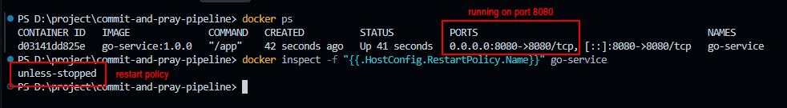

---

## 5. Binary Hotfix

For the hotfix scenario, the Docker image is kept as it is.

Instead of rebuilding the image, a new Go binary is built and copied into
the existing container.

The `docker cp` approach is used because it is simple and quick for a small
application fix.

### Hotfix Flow

Build new binary → Copy binary → Restart container → Verify

### Before Hotfix

The current application version is checked first.

`curl http://localhost:8080`

Expected:

`Hello, DevOps! version=1.0.0`

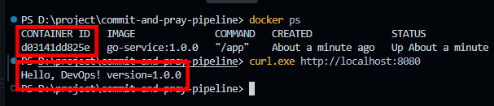

### Build the New Binary

A new binary is built with the updated application version.

The binary is built as a Linux static binary so it can run inside the
existing container.

### Binary Swap

The new binary is copied into the existing container using `docker cp`.

No new Docker image is created during this step.

### Restart

The existing container is restarted so it starts using the new binary.

### After Hotfix

The application is checked again after the restart.

`curl http://localhost:8080`

Expected:

`Hello, DevOps! version=1.0.1`

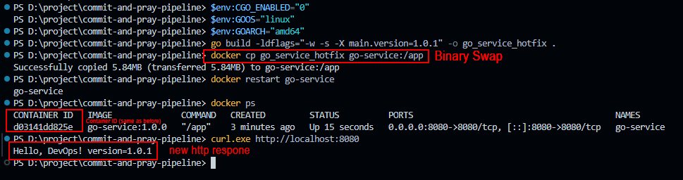

The version changes from `1.0.0` to `1.0.1` while the existing container is
kept.

---

## Why `docker cp`?

I chose `docker cp` because it is simple and fast for a small hotfix.

The new binary can be copied into the existing container and restarted
without rebuilding the Docker image or creating a new container.

The downside is that the container filesystem becomes mutable, so this is
better suited for quick hotfixes than normal deployments.

---

# Part III — CI/CD with Jenkins

This part connects the build process from Part I and the deployment process
from Part II into a single Jenkins pipeline.

The pipeline automatically checks the source code, runs tests, builds a
versioned Docker image, and triggers the binary replacement process during
deployment.

---

## 7. Checkout

Jenkins pulls the source code from the private GitHub repository using
Jenkins Credentials.

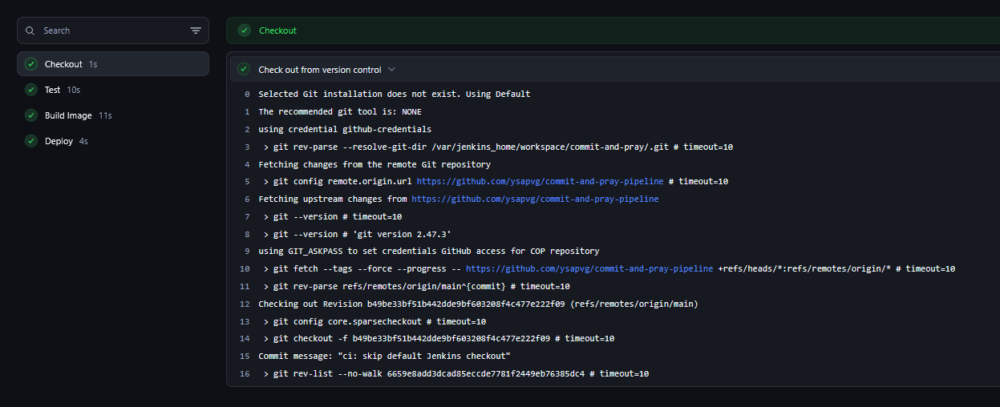

---

## 8. Test

The pipeline runs:

`go test ./...`

The tests are executed before the build and deploy stages.

If the tests fail, Jenkins stops the pipeline and does not continue to the
next stages.

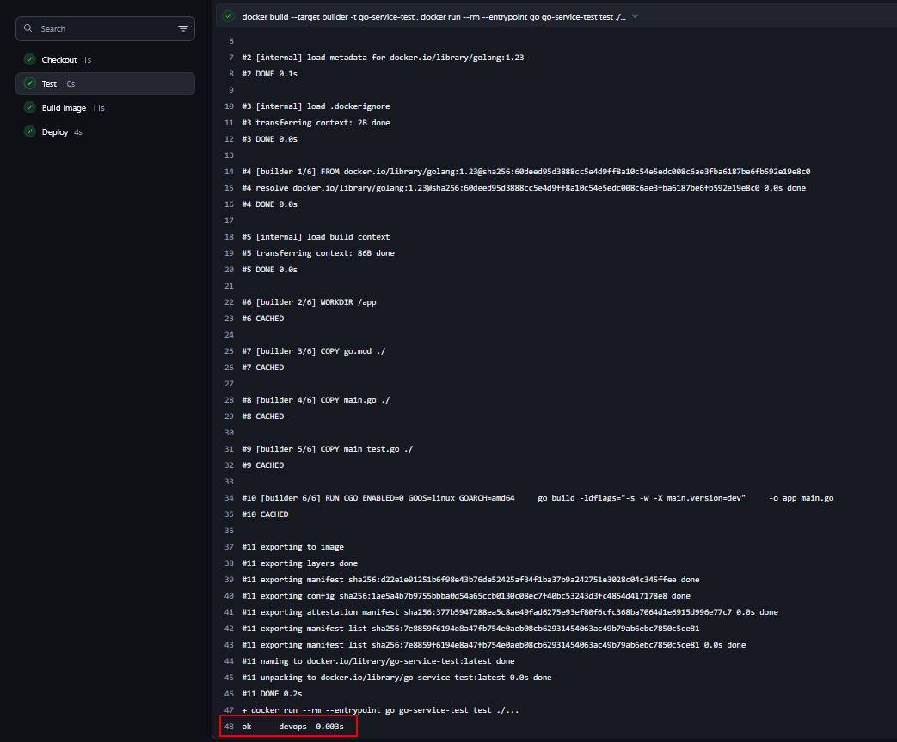

---

## 9. Build Image

After the tests pass, Jenkins gets the short Git commit hash using:

`git rev-parse --short HEAD`

The commit hash is used as the Docker image tag and is also injected into
the application version using `-ldflags`.

Example:

`go-service:7d58d10`

This makes each image easy to trace back to its source code commit.

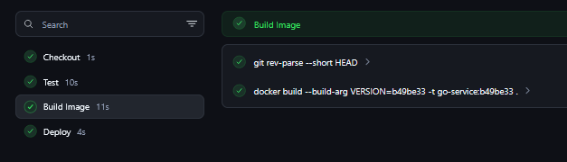

---

## 10. Deploy

The deploy stage triggers the binary replacement mechanism from Part II.

The new binary is taken from the newly built image, the current binary is
backed up, and the new binary is copied into the existing container.

The container is then restarted.

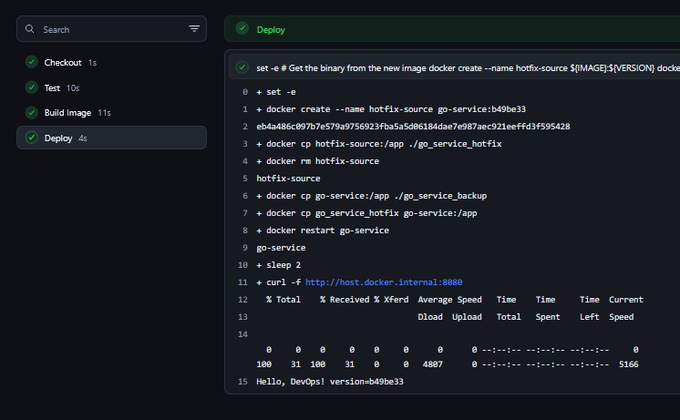

## 11. Verify

After deployment, Jenkins checks the application response and confirms that
the expected version is running.

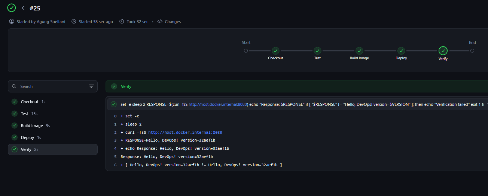

## 11. Rollback

The previous binary is backed up before the new binary is deployed.

If the deployment or verification fails, Jenkins restores the previous
binary and restarts the container.

The pipeline is still marked as failed so the deployment issue is not hidden.

### Rollback Flow

Deploy → Failure → Restore Previous Binary → Restart → Verify

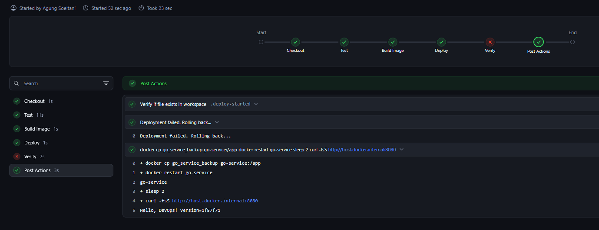

---

## 12. Jenkins Credentials

The GitHub access token is stored in Jenkins Credentials instead of being
written directly into the Jenkinsfile.

This keeps the credential outside the source code.

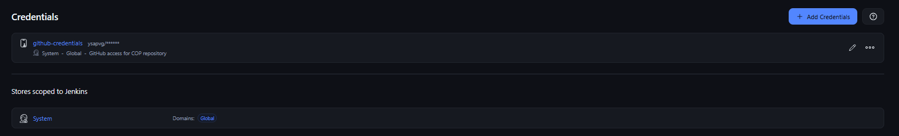

---

## 13. Successful Pipeline

The final pipeline completes all stages successfully:

Checkout → Test → Build Image → Deploy → Verify

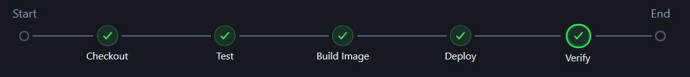

---

## Part III Summary

Part I prepares the Docker image.

Part II provides the binary hotfix mechanism.

Part III connects both parts into an automated Jenkins pipeline.

The final flow is:

GitHub → Jenkins → Test → Build Image → Binary Swap → Restart → Verify

---
